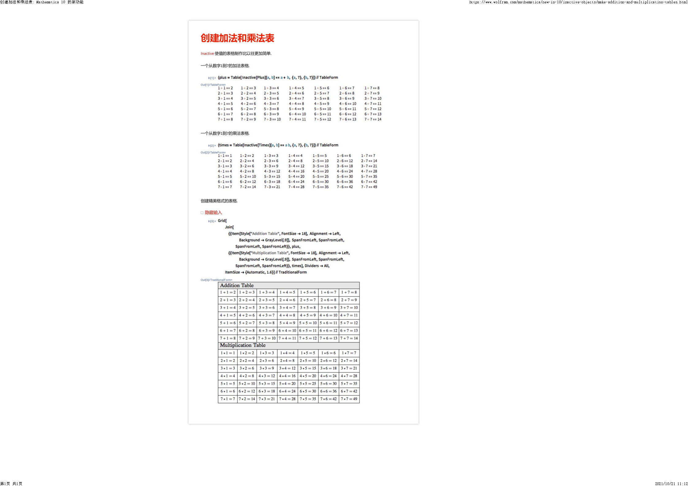

# Power-Table-master
1到100乘方表.nb by Felix-K340 

程序说明：

Mathematica 10 的新功能 

› 未激活对象（Inactive）函数的巧妙用法

官网https://www.wolfram.com/mathematica/new-in-10/inactive-objects/make-addition-and-multiplication-tables.html
根据计数基本法则给出了7x7加法表以及乘法表，而乘方表作为中小学生必需加强记忆的内容却未给出；
 
本程序依据官网介绍的方法，使用了Internal`PartitionRagged（*或TakeList函数，但该函数下一步会出现错误无法成表*）将10x10
乘方表整理成列表进行排版，打印出来类似于在LaTeX下生成效果。

附mathematica打印方法：需要某段程序机器运行结果时，选中其单元Crtl+P。（格式在文件---打印设置中更改或者可直接上代码）

本例程序在mathematica12.3.1平台运行

